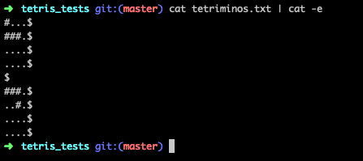
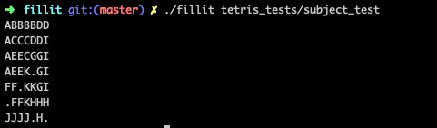

# Fillit
First Algo Project @ 42 Paris.

**Project score : [99 / 100]**

Fillit is an algorithmic project that consists of finding the smallest square possible using the given tetriminos.
Execution time was a constraint in this project, so implementing an optimal backtracking algorithm was the core of this project. 

## Installation and usage

```
git clone https://github.com/andrewrzepecki/fillit && cd fillit && make
```

The program recieves a file containing valid tetriminos in this format:



Tetriminos pieces must be 4x4 format, using '#' and '.' to form the piece, and must be seperated by a newline.

**Example:**

```
./fillit [tetris_pieces]
```



The tetriminos pieces are distinguished with their own unique character: 'A' for the first tetriminos supplied, 'B' for the second, 'C' for the third ...

The concept of our algorithm is to recursively test each tetriminos, starting in an area the size of the sum of the given tetriminos areas.
